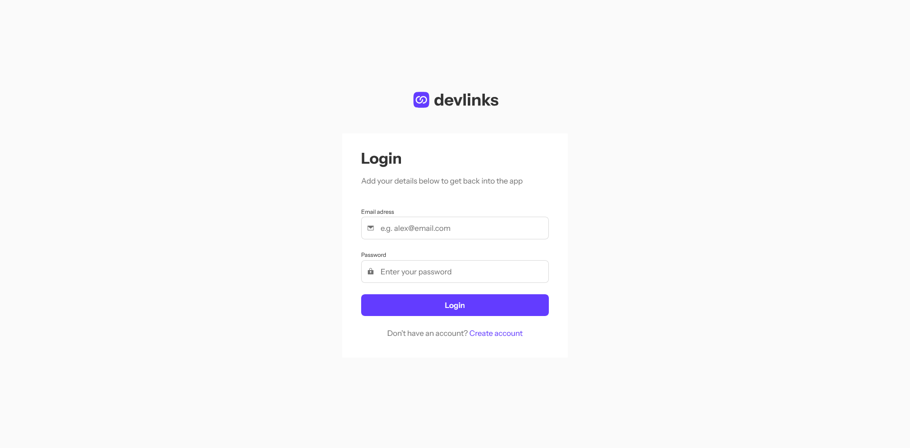
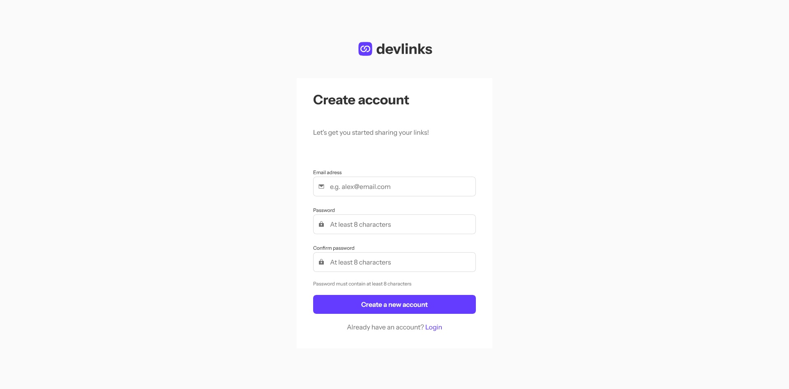
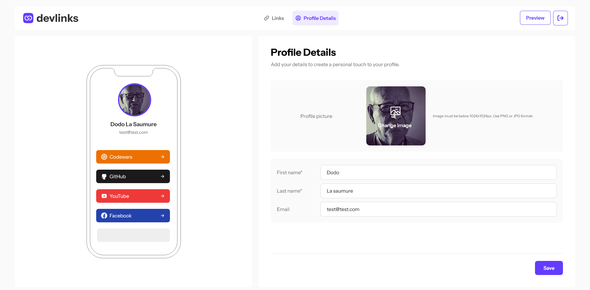
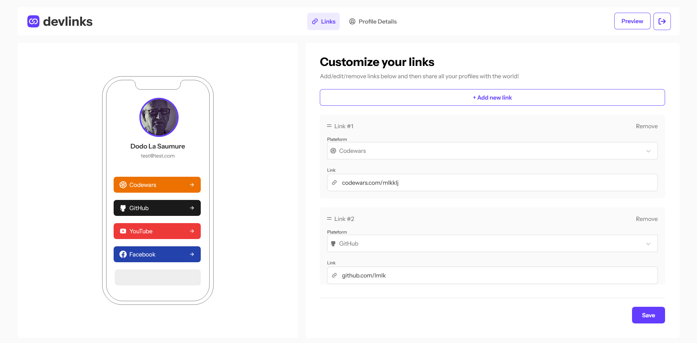
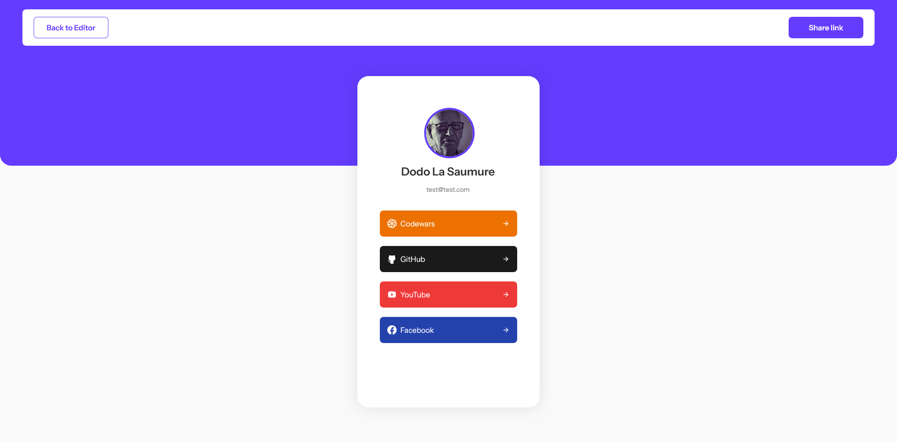

# Frontend Mentor - Link-sharing-app solution

This is a solution to the [Link-sharing-app on Frontend Mentor](https://www.frontendmentor.io/challenges/linksharing-app-Fbt7yweGsT). Frontend Mentor challenges help you improve your coding skills by building realistic projects.

## Table of contents

- [Overview](#overview)
  - [The challenge](#the-challenge)
  - [Screenshot](#screenshot)
  - [Link](#link)
- [My process](#my-process)
  - [Try](#try)
  - [Built with](#built-with)
  - [Versions](#versions)
  - [What I learned](#what-i-learned)
  - [Continued development](#continued-development)
- [Author](#author)

## Overview

### The challenge

Users should be able to:

- Create, read, update, delete links and see previews in the mobile mockup
- Receive validations if the links form is submitted without a URL or with the wrong URL pattern for the platform
- Drag and drop links to reorder them
- Add profile details like profile picture, first name, last name, and email
- Receive validations if the profile details form is saved with no first or last name
- Preview their devlinks profile and copy the link to their clipboard
- View the optimal layout for the interface depending on their device's screen size
- See hover and focus states for all interactive elements on the page
  -Save details to a database (build the project as a full-stack app)
  -Create an account and log in (add user authentication to the full-stack app)

### Screenshot







### Links

- Solution URL: [frontend Mentor solution](https://www.frontendmentor.io/solutions/link-sharingapp-solution---full-stack---nextjs-and-nodejs-s07Y6vZhS6)
- Live Site URL: [Live site](https://link-sharing-app-silk.vercel.app/)

## My process

### Try

You can login with the user "test" or signup :

```bash
email : test@test.com
```

```bash
password : 0000
```

### Built with

- Tailwind Css
- Next.js
- Node.js
- Typescript
- Zustand store
- MongoDb

### Version

- node.js : 20.11.0
- "bcrypt": "^5.1.1",
- "cookies": "^0.9.1",
- "dotenv": "^16.4.5",
- "jose": "^5.6.3",
- "js-cookie": "^3.0.5",
- "mongodb": "^6.8.0",
- "next": "^14.2.4",
- "react": "^18.3.1",
- "react-dom": "^18.3.1",
- "react-responsive": "^10.0.0",
- "zustand": "^4.5.4"
- tailwindcss": "^3.4.4",
- typescript": "^5"

### What I learned

- practice Zustand store with local and backend state
- backend with node.js and mongodb
- upload image to cloud

### Continued development

- Practice backend
- Try Clerc and Stripe integration

## Author

- Github- [Github](https://github.com/Stv-devl)
- Frontend Mentor - [@Stv-devl](https://www.frontendmentor.io/profile/Stv-devl)
